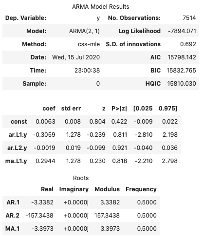
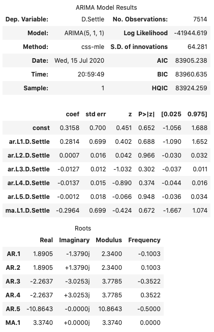
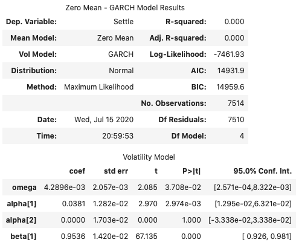
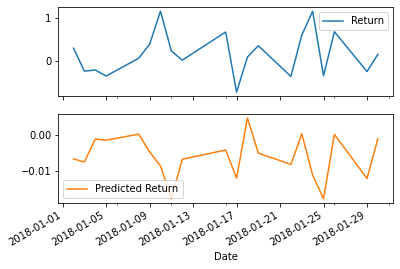

# Currensy Predictions

## Return Forecasting: Historical Daily Yen Futures Data and Predictions

Based on the p-value, is the model a good fit?

- No. Given the p-value is significantly greater than .05, we can conclude that this model is not a good fit. 

What does the model forecast will happen to the Japanese Yen in the near term?

- The model forecasts that the Yen futures price is likely to increase in value over the next 5 days. 

Based on your time series analysis, would you buy the yen now?

- So long as I'm comfortable with the risk associated with the model, I would buy the Yen now because overall the Yen futures returns are trending upwards. I would feel more comfortable buying if I plan to take a long instead of short position on this asset.

Is the risk of the yen expected to increase or decrease?

- The risk associated with the Yen is expected to increase.

Based on the model evaluation, would you feel confident in using these models for trading?

- Only if I enjoy gambling. A prudent investor would likely disregard these models and build a more accurate and precise model to help advise their trading strategy.

## Regression Analysis: Predicting Yen Futures

Unfortunately, because of the relatively high RMSE error values we can conclude that our model is not very good at predicting the Yen futures returns by using lagged Yen futures returns. 
